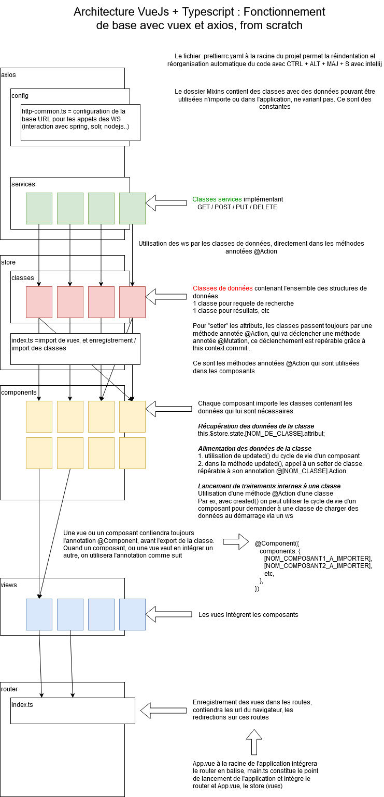

# periscope-poc-vue-js-latest

Le package node_module ne doit jamais être présent avant le premier pull du projet. En cas
de présence du package, le supprimer, puis faire :
```bash
npm install
```
Si certaines dépendances n'arrivent pas à être détectées, faire avec webstorm
File -> invalidate caches and restart
Puis relancer le projet

Se rendre ensuite dans le package.json puis lancer le script serve.

## Notes de developpement
Projet crée avec vue/cli4, en vue 2, avec vuetify 2, axios, jest, et gantt-timeline.
Pour visualiser l'avancement du projet, aller sur la branche develop.
Développeur: Thomas Angot
Tuteur: Jerome Villiseck

Attention ! Vuetify ne fonctionne pas avec un Vue3 project crée avec vue-cli au 16.11.2020, et qu'importe la version du vue-cli (vue2 uniquement).

## From scratch

Le projet à été crée en plusieurs étapes.
1. Mise en place de l'architecture de base (vueJS + typescript) avec vue-cli
   [Lancement from scratch](./documentation/VueJsTypescriptFromScratchInitializationNewProject.pdf)
1. Installation de vuetify après amorçage du projet avec vue-cli
   [Ajout de vuetify au projet](./documentation/VuetifyAddingAtTheProject.pdf)
1. Création des composants et des vues de base
   [Utilisation de la syntaxe typescript](./documentation/VueJsTypescriptFromScratchInitializationNewProject.pdf)
1. Mise en place de vuex, création des classes, déportage des données utilisées par les composants dans les classes, interaction entre les données des classes, récupération et alimentation à travers les composants
   [Etape d'ajout de vuex point 5](./documentation/VueJsTypescriptFromScratchInitializationNewProject.pdf)
1. Mise en place d'axios, tests de ws, utilisation d'axios directement dans les classes.
   [Etape d'ajout d'Axios](./documentation/VueXiosAxios.pdf)

## Architecture



## Project initialization
```
npm install -g @vue/cli
```

```
vue create periscope-poc-vue-js-latest
```
1. vue2, babel, router, vuex, linter, unit testing (jest).
2. cd [emplacement du projet]

```
vue add vuetify
```

## Project setup
```
npm install
```

### Compiles and hot-reloads for development
```
npm run serve
```

### Compiles and minifies for production
```
npm run build
```

### Run your unit tests
```
npm run test:unit
```

### Lints and fixes files
```
npm run lint
```

### Customize configuration
See [Configuration Reference](https://cli.vuejs.org/config/).


### Force resolution of vulnerabilities
install in package.json file
```javascript
"scripts": {
    "serve": "vue-cli-service serve",
    "build": "vue-cli-service build",
    "test:unit": "vue-cli-service test:unit",
    "lint": "vue-cli-service lint",
    "preinstall": "npx npm-force-resolutions"
  },
  "resolutions": {
    "yargs-parser": "15.0.1"
  },
```
As the example, the script preinstall was added, and a specific version of yargs-parser (who depends on top level jest npm module)
will be forced to update in node_module.
Then, run the script: npx npm-force-resolutions
and just tap on commands:
```
npm i && npm audit fix --force
```
Tip: think to run the script after each npm installation modules.

##Router bug (warning)

Please tap after the creation of your vuetify project

```
vue add router
```

And this will restore functionalities on router.
